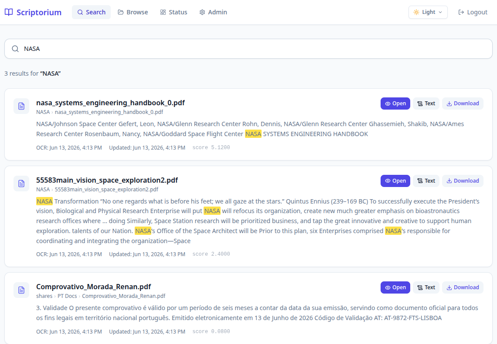
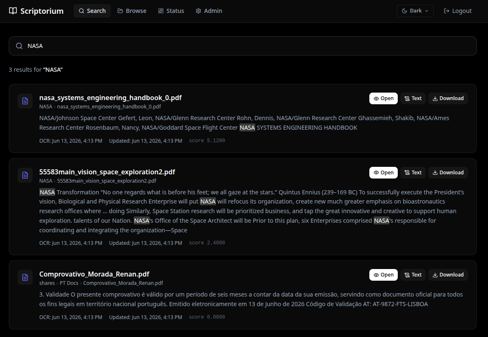
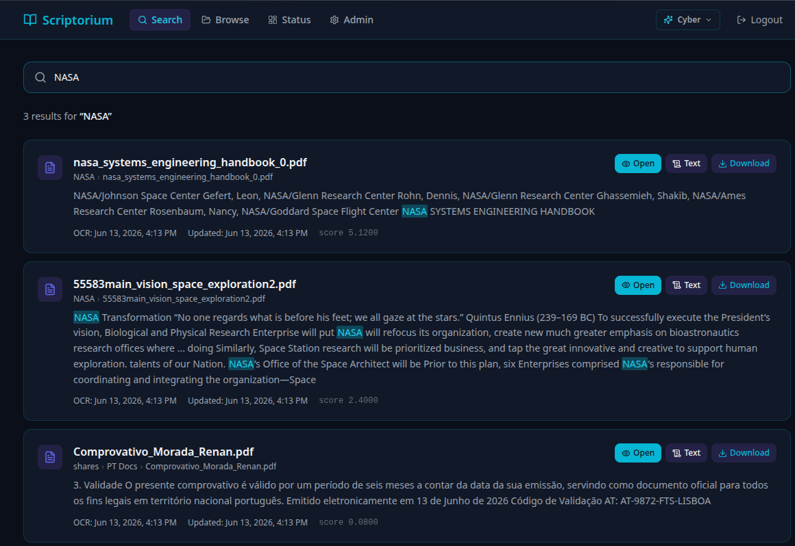
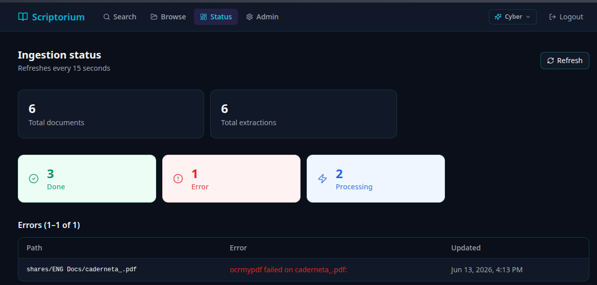

#  Scriptorium

A self-hosted document archive with OCR and full-text search. Point it at a read-only folder of PDFs, images, and Office files; it extracts text in the background and gives you a fast search UI over everything.

> [!NOTE]
> **What is a Scriptorium?** Historically, a *scriptorium* (literally "a place for writing") was a room in medieval European monasteries devoted to the writing, copying, and illuminating of manuscripts by monastic scribes. True to its name, this app acts as your digital scriptorium—automatically copying, reading, and indexing all your documents.

## Preview

<p align="center">
  
  
  
</p>

<p align="center">
  
</p>

---

## What it does

- **Automatic indexing** — a scanner polls your corpus directory at a configurable interval and enqueues any new or changed files
- **Multi-format OCR** — PDFs (including digitally signed and custom-font-encoded ones), images, DOCX, XLSX, ODS
- **Full-text search** with five ranked match modes: phrase/boolean FTS, prefix matching, trigram substring, digit-normalised numeric search, and single-word fuzzy/typo tolerance
- **Text editor** — view the raw OCR output per page, correct mistakes, and revert to the original at any time; corrections update search immediately
- **File viewer** — inline preview and download for any indexed file
- **Single-user auth** via JWT — no user management, just a username and password

---

## Architecture

```
                     ┌──────────────┐
  Browser ──HTTPS──► │ ext. Nginx   │  (not part of this stack)
                     └──────┬───────┘
                            │ HTTP
                     ┌──────▼───────┐
                     │   web        │  FastAPI + built React UI
                     └──┬───────┬───┘
                        │       │
               ┌────────▼──┐ ┌──▼────────┐
               │ postgres  │ │   redis   │
               └────────▲──┘ └──▲────────┘
                        │       │
               ┌────────┴──┐ ┌──┴────────┐
               │  scanner  │ │ocr-worker │ (N replicas)
               └───────────┘ └───────────┘
                        │           │
                   ╔════▼═══════════▼════╗
                   ║  /corpus  (NFS :ro) ║
                   ╚═════════════════════╝
```

| Service | Role |
|---|---|
| `web` | FastAPI backend + Vite-built React SPA served as static files |
| `postgres` | Document catalog + extracted text + FTS indexes (`pg_trgm`) |
| `redis` | OCR job queue |
| `scanner` | Polls corpus via `os.walk`/`stat`; no inotify, safe over NFS |
| `ocr-worker` | Pulls jobs from Redis; runs OCRmyPDF → Tesseract; writes extracted text to Postgres |

Postgres and Redis have **no published host ports** — internal Docker network only.

---

## Requirements

- Docker and Docker Compose v2
- A directory of documents (NFS share, local path, etc.) readable by uid `1000`
- An external reverse proxy (Nginx, Caddy, …) for TLS termination — the stack exposes plain HTTP

---

## Getting started

### 1. Clone and configure

```bash
git clone <repo-url> scriptorium
cd scriptorium
cp env.example .env
```

Edit `.env` — every value with `changeme` **must** be changed before first run.

### 2. Generate a secret key

```bash
python3 -c "import secrets; print(secrets.token_hex(32))"
```

Paste the output as `SECRET_KEY` in `.env`.

### 3. Start the stack

```bash
docker compose up -d
```

On first start Postgres runs `postgres/init.sql`, which creates the schema and indexes. The scanner fires within a few seconds and begins enqueuing files; OCR workers pick them up immediately.

### 4. Open the UI

Navigate to `http://<your-host>:<WEB_PORT>` (default `8000`) and log in with the `UI_USERNAME` / `UI_PASSWORD` you set.

---

## Environment variables

All variables live in `.env` (copied from `env.example`). `.env` is gitignored and never baked into images.

### Database

| Variable | Required | Default | Description |
|---|---|---|---|
| `POSTGRES_USER` | yes | — | PostgreSQL username |
| `POSTGRES_PASSWORD` | yes | — | PostgreSQL password |
| `POSTGRES_DB` | no | `scriptorium` | Database name |

### Redis

| Variable | Required | Default | Description |
|---|---|---|---|
| `REDIS_PASSWORD` | yes | — | Redis AUTH password |

### Web / auth

| Variable | Required | Default | Description |
|---|---|---|---|
| `UI_USERNAME` | yes | — | Login username for the web UI |
| `UI_PASSWORD` | yes | — | Login password for the web UI |
| `SECRET_KEY` | yes | — | 64-char hex string used to sign JWTs — generate once, never change |
| `WEB_PORT` | no | `8000` | Host port the web container publishes |

### Corpus

In linguistics and natural language processing, a **corpus** (plural *corpora*) is a large, structured collection of texts or documents. In Scriptorium, your "corpus" is the folder containing all your source documents (PDFs, images, spreadsheets, etc.) that you want to index.

The `CORPUS_PATH` represents the absolute host path to this folder, which Scriptorium mounts as a read-only (`:ro`) directory.

| Variable | Required | Default | Description |
|---|---|---|---|
| `CORPUS_PATH` | yes | — | Absolute path on the Docker host to your document directory. Mounted `:ro` into every container — **originals are never written, moved, or deleted** |

### Scanner

| Variable | Required | Default | Description |
|---|---|---|---|
| `SCAN_INTERVAL` | no | `300` | Seconds between corpus scans |
| `MISS_THRESHOLD` | no | `2` | Consecutive scan misses before a file is removed from the catalog. Only applies when `PRESERVE_CATALOG=false`. |
| `PRESERVE_CATALOG` | no | `true` | When `true`, the scanner never removes documents from the index automatically. Use the **Admin** page in the UI for intentional manual cleanup. Strongly recommended when the corpus is on a NAS. |

### OCR workers

| Variable | Required | Default | Description |
|---|---|---|---|
| `OCR_WORKER_COUNT` | no | `4` | Number of parallel OCR worker replicas |
| `OCR_ENGINE` | no | `tesseract` | OCR backend (currently only `tesseract`) |

---

## Search syntax

The search bar accepts PostgreSQL `websearch_to_tsquery` syntax plus automatic fallbacks:

| What you type | How it matches |
|---|---|
| `apple` | Full-text + prefix (`apple*`) + trigram substring |
| `epple` | Fuzzy match (typo tolerance via `word_similarity`) — single word, ≥ 4 chars |
| `main.tf` | Trigram substring — finds terms embedded in technical strings |
| `201790130509` | Digit-normalised — strips separators, matches the raw digit sequence anywhere in the text |
| `314 493 050` | Same digit-normalised path — spaces/dashes between digits are ignored |
| `"annual report"` | Exact phrase (FTS phrase operator) |
| `cloud AND storage` | Boolean AND |
| `invoice -draft` | Exclude term |

Results are ranked: exact FTS > prefix > trigram > digits > fuzzy.

---

## OCR pipeline

Files are processed in this order:

1. **pdftotext** — fast text extraction for electronically-generated PDFs
2. **OCRmyPDF** (`skip_text=True`) — adds an OCR layer to scanned PDFs without a text layer
3. **Garbled-font detection** — if > 70% of extracted characters are the same letter (obfuscated custom font encoding), falls back to:
4. **Force OCR** (`force_ocr=True`) — re-renders every page and runs Tesseract
5. **Render fallback** — if the PDF is digitally signed (OCRmyPDF refuses `force_ocr` on signed PDFs), uses `pdftoppm` to render pages as images and runs Tesseract directly

### Multi-Language Setup

By default, the OCR engine is configured with **English**, **Portuguese**, and **German** language packs. 

If you want to add support for new languages (e.g., Spanish or French):
1. **Install the Tesseract language pack**: Open [worker/Dockerfile](file:///home/rtm/GIT-REPOS/REPOS/scriptorium/worker/Dockerfile) and add the package name to the `apt-get install` list:
   ```dockerfile
   tesseract-ocr-spa \
   tesseract-ocr-fra \
   ```
2. **Enable the language in the OCR engine**: Open [worker/ocr/engine.py](file:///home/rtm/GIT-REPOS/REPOS/scriptorium/worker/ocr/engine.py) and update the `lang` parameter in the `pytesseract.image_to_string` call (around line 153):
   ```python
   text = pytesseract.image_to_string(img, lang="por+deu+eng+spa+fra")
   ```
3. **Rebuild the workers**: Run this command to rebuild and restart all OCR worker containers:
   ```bash
   docker compose up -d --build ocr-worker
   ```

**Supported file types:** PDF, PNG, JPG/JPEG, TIFF, BMP, GIF, WEBP, DOCX, XLSX, XLS, ODS, TXT, CSV, TSV, MD

---

## Text corrections

Every indexed document has a **Text** button that opens a dedicated editor page. You can:

- View the full OCR output page by page
- Edit any page's text — corrections are saved to Postgres and update search immediately
- Toggle between corrected and original text
- Revert a page back to the original OCR output at any time

The original OCR text is always preserved in `extractions.original_text` and is never overwritten.

---

## Data persistence

| What | Where |
|---|---|
| Document catalog + extracted text | `postgres_data` Docker volume |
| Redis job queue | `redis_data` Docker volume |
| Original files | Your corpus directory — never touched by Scriptorium |

---

## NFS safety and MISS_THRESHOLD

The scanner has two layers of protection against accidental mass-purge when your NAS goes offline:

1. **Hard mount failure** (stale handle, connection refused, etc.) — `os.scandir()` throws an `OSError`. The scanner logs the error and skips the entire scan, including deletion reconciliation. `miss_count` is never incremented. Your library survives indefinitely.

2. **Silent mount failure** (soft NFS mount that returns an empty directory instead of an error) — the scanner detects that the walk returned zero files while the DB still has documents and skips deletion reconciliation with a warning. This is the dangerous edge case that `MISS_THRESHOLD` alone cannot protect against.

The default `MISS_THRESHOLD=2` is designed for genuinely deleted files, not NFS outages. If you want extra headroom for the case where a handful of files go missing for a legitimate reason (e.g. NFS partially mounted), raise it:

```bash
# .env — 288 scans × 300s = 24 hours before any file is purged
MISS_THRESHOLD=288
```

For best reliability, mount your NFS share with `hard` and `timeo`/`retrans` options so the kernel blocks rather than returning stale data silently.

---

## Design constraints

These are intentional, not limitations:

- **No inotify** — the scanner uses `os.walk` + `stat` polling. inotify is invisible to NFS clients and would silently miss remote changes.
- **No in-stack reverse proxy** — TLS is handled by an external Nginx on a different machine.
- **No object storage** — files are served directly from the read-only NFS mount.
- **No semantic/vector search in v1** — `pgvector` is installed but unused; planned for a future phase.
- **Corpus is read-only** — Scriptorium has zero write access to your original files, by design.

---

## What's coming next (Roadmap)

We are planning to expand Scriptorium's capabilities with AI-driven tagging and intelligent search features:

- **AI Support & LLM Integration**
  - Native integration with **Ollama** (for local offline LLM runs), **OpenAI**, and **Google Gemini/Vertex AI**.
- **Intelligent Tagging System**
  - **Auto-Tagging**: Documents will be automatically tagged based on a combination of their folder path, file name, and extracted text.
  - **Manual Tagging**: Direct, user-facing controls to manually add, edit, or remove tags on any document from the UI.
  - **Quality over Quantity**: A "less is more" tagging philosophy where only high-value, relevant categories are assigned.
  - **Multi-tag support**: Documents can have multiple tags if they match multiple categories (e.g. a water invoice would get both `bills` and `water` tags).
- **Semantic Search**
  - **Basic & Context-Aware Semantic Search**: Integrate vector embedding models with `pgvector` to enable conceptual, semantic search queries (e.g., searching for "proof of address" will locate utility bills or residency certificates even if the exact phrase "proof of address" is not present in the document).
